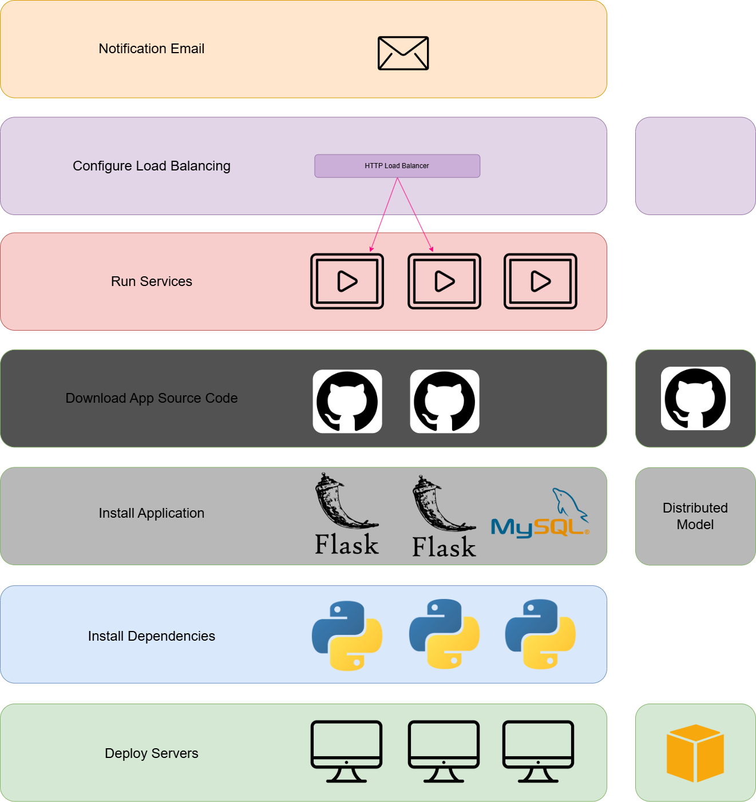

# Ansible-AWS Project: Automated Deployment of a Load-Balanced Web Application with MySQL

This project automates the deployment of a web application on AWS using Ansible. It provisions a MySQL database server, two Flask web servers, and an AWS Classic Load Balancer (CLB) to distribute traffic. The setup includes dynamic inventory management, secure credential handling with Ansible Vault, and email notifications upon completion—all orchestrated through Ansible playbooks.

## Project Overview

- **Infrastructure**:
  - 1 MySQL database server (`db-server`)
  - 2 Flask web servers (`web-server`)
  - 1 AWS Classic Load Balancer (CLB)
- **Automation Goals**:
  - Provision EC2 instances
  - Configure security groups
  - Set up MySQL and Flask applications
  - Deploy the load balancer
  - Send deployment notifications
- **Security**:
  - Credentials encrypted with Ansible Vault
  - Minimal permissions via security groups

Overview:

  
## Prerequisites

- **AWS Free Tier Account**: An active AWS account.
- **WSL (Windows Subsystem for Linux)**: For running Linux commands on Windows.
- **AWS CLI**: Installed and configured with IAM credentials.
- **Ansible**: Installed on your local machine or WSL.
- **VSCode**: Configured with the "Remote - WSL" extension for development.

## Setup and Usage

See [docs/SETUP.md](docs/SETUP.md) for detailed setup instructions.

Remember to modify the default-values with your own ones:
  - ansible.cfg
  - aws_ec2.yml
  - create_ec2.yml
  - vault.yml
  - flask_web/tasks/main.yml (use your own repo to retrieve the flask app)
  - setup_clb/tasks/main.yml (your subnet and sg IDs)

## Learnings

- Dynamic inventory management with Ansible
- Managing and automating security group rules and network security
- Secure credential storage and handling sensitive information (e.g., Ansible Vault)
- Load balancing configuration and automation (e.g., ELB, ALB in AWS)
- Automating infrastructure provisioning and resource management
- Handling high availability and fault tolerance in cloud environments
- Integration of Auto Scaling with infrastructure deployments

## Future Improvements

- HTTPS support
- Enhanced database automation
- CloudWatch monitoring
